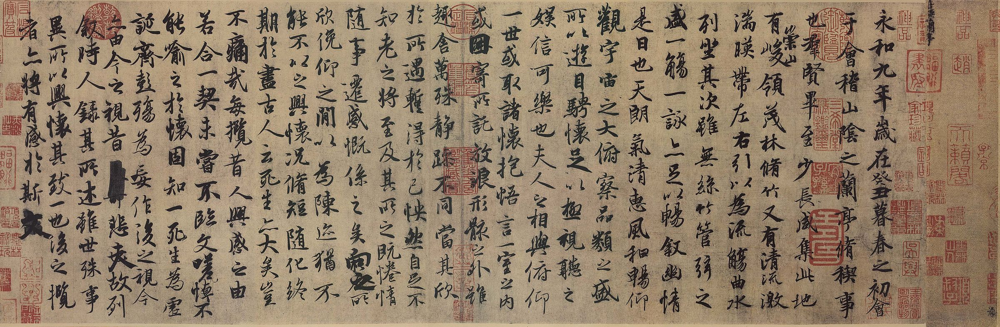

# Welcome to my homepage!
Updates on my research and expository papers, discussion of open problems, and other maths-related topics. *Last updated on September 29, 2026*

### About Me
Hi, I'm Yijie Miao (Chinese Name: 苗祎杰, Wade-Giles romanization: Miao I-chieh), a student in [the Department of Mathematics at Southeast University](https://math.seu.edu.cn/). I like puzzles, manga, Chinese chess, Go, and tennis.

最近想学习阅读一些 Geometric Measure Theory, Spectral Geometry and Scalar Curvture 方面的内容.

##### 谱几何选用的教材是首师大 hzl 学长推荐的两本：[Topics in Spectral Geometry](/notes/Spectral_geometry/TSG230529.pdf) 和 [GTM 276](/notes/Spectral_geometry/functional-analysis-spectral-theory-applications-einsiedler-ward.pdf).
-----

“在碌碌无为和激动人心之间徘徊, 然后艰难曲折地前行, 是大部分研究者的心态.”
